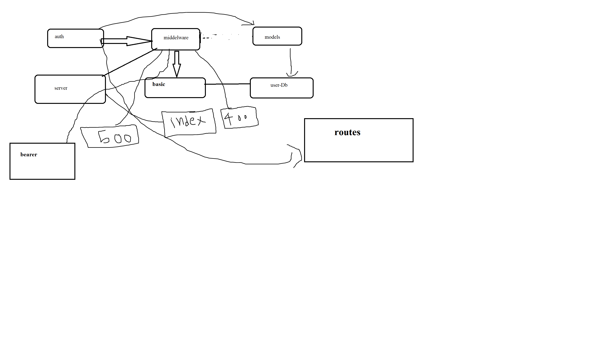
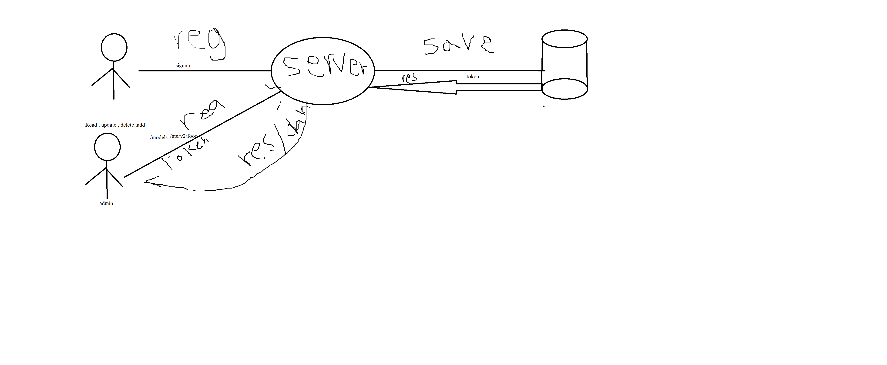

# LAB - Class 08

## Project:bearer-auth

### Author: Mohammad Amjad Alazzam

### Links and Resources

- [ci/cd](https://github.com/MohdAzzam/auth-api/actions)
- [back-end server -dev](https://azzam-auth-api.herokuapp.com/)

### Setup

#### `.env` requirements (where applicable)

- `PORT` - Port Number
- `MONGO_URI` -the link to connect to mongo DB

#### How to initialize/run your application (where applicable)

- `npm start`

#### How to use your library (where applicable)

- `npm install `

#### Tests

- How do you run tests? `npm test`

#### UML

